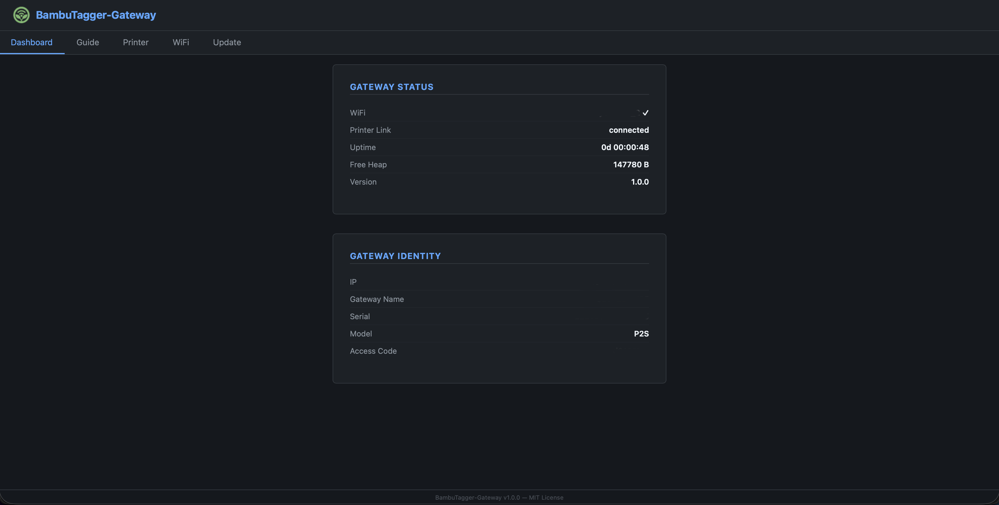

# BambuTagger-Gateway

Multi-client bridge for Bambu Lab printers — breaks the 3-connection limit by multiplexing MQTT, camera, and FTPS traffic through a single ESP32-S3 gateway.

[](https://ko-fi.com/G8M220JASY)

<p align="center">

</p>

---

## Quick Start

### 1. Flash the Gateway

```bash
# Install PlatformIO
pip install platformio

# Build and flash
pio run -e esp32-s3 -t upload --upload-port /dev/ttyACM0
```

### 2. Connect to the Gateway

After boot, the gateway creates a WiFi network named **`BambuTagger-Gateway`** (open). Connect your computer or phone to it, then open **http://192.168.4.1** in a browser.

### 3. Configure Printer Settings

From the web UI, go to the **Printer** page and enter:
- **Hostname / IP** — your printer's LAN IP address
- **Access Code** — 8-digit code from your printer's Settings → Network page
- **Serial Number** — found in Settings → General → Machine Info
- **Printer Model** — your printer model (P1S, X1C, A1, etc.)

Click **Save & Reboot**. After reboot, check the Dashboard — **Printer Link** should show "connected" and the gateway's LED should turn off.

### 4. Set Up Bambu Studio

Open Bambu Studio → **Prepare** tab → click the printer icon → **Add Printer**. Select your model, choose **LAN** mode, and enter:
- **IP Address**: the gateway's IP (shown on the Dashboard)
- **Access Code**: your printer's access code

The gateway will relay all traffic (MQTT, camera, file transfer) to the real printer transparently. No certificate import is needed — TLS is end-to-end encrypted with the printer's own certificate.

> For detailed steps, open the **Guide** page in the web UI.

---

## Features

| Category | Details |
|---|---|
| **MQTT multiplexer** | One upstream MQTT connection to the printer; up to 8 local clients can subscribe/publish simultaneously via the gateway (port 1883) |
| **TLS passthrough** | Port 8883 transparently relays TCP to the printer — Bambu Studio connects with end-to-end TLS, no certificate configuration needed |
| **Camera broadcast** | Single upstream connection to printer camera stream; broadcasts to all connected local clients |
| **FTPS forwarder** | Single upstream FTPS connection; forwards control/data to local clients |
| **WiFi AP mode** | Creates `BambuTagger-Gateway` access point — clients connect directly to the gateway, no LAN reconfiguration needed |
| **Station mode** | Optionally joins your existing WiFi network alongside the AP |
| **mDNS** | Advertises as `BambuTagger-Gateway.local` with `_bambu._tcp` (TXT: serial, model, version) for Bambu Studio discovery |
| **Auto-resubscribe** | Tracks all client subscriptions; re-subscribes upstream on reconnect |
| **Topic-aware routing** | Correctly handles `#`, `+` wildcards when forwarding printer reports to local clients |
| **Web UI** | Dashboard, Printer settings, WiFi settings, firmware update — served from the gateway |
| **Auto-update** | One-click firmware update from latest GitHub release |
| **Fake printer mode** | Responds to Bambu Studio MQTT queries (model, serial, idle status) on any `device/X/request` topic when no real printer is connected; sends printer identity immediately on subscribe for auto-detection |
| **Status LED** | Built-in LED indicates WiFi/MQTT connection state at a glance |

---

## How It Works

Bambu Lab printers accept **3 simultaneous connections**. Once that limit is hit, new clients are rejected. This gateway connects as a **single client per service** and lets many local clients share those connections.

```
┌──────────────────┐      ┌──────────────────────────┐      ┌─────────────────┐
│ Bambu Studio     │─────>│                          │─────>│                 │
│ (TLS 8883)       │──┬──>│  ESP32-S3 Gateway        │──┬──>│  Bambu Lab      │
├──────────────────┤  │   │  ┌────────────────────┐  │  │   │  Printer        │
│ MQTT Client 1    │  │   │  │ MqttBridge         │  │  │   │  ┌───────────┐  │
│ MQTT Client 2    │──┼──>│  │ (plain 1883,       │──┼──┼──>│  │ MQTT 8883 │  │
│ MQTT Client 3    │  │   │  │  upstream TLS)     │  │  │   │  ├───────────┤  │
│      ...         │  │   │  ├────────────────────┤  │  │   │  │ Camera    │  │
│ MQTT Client 8    │  │   │  │ TLS Passthrough    │  │  │   │  │ Stream    │  │
├──────────────────┤  │   │  │ (8883 → printer)   │──┘  │   │  ├───────────┤  │
│ Camera Client    │──┼──>│  ├────────────────────┤     │   │  │ FTPS 990  │  │
│ Camera Client    │  │   │  │ Camera Proxy       │─────┼──>│  └───────────┘  │
│      ...         │  │   │  │ (6000 → printer)   │     │   │                 │
│ Camera Client    │  │   │  ├────────────────────┤     │   │                 │
├──────────────────┤  │   │  │ FTPS Proxy         │─────┼──>│                 │
│ FTP Client       │──┼──>│  │ (990 → printer)    │     │   │                 │
│ FTP Client       │  │   │  └────────────────────┘     │   │                 │
│      ...         │  │   │                             │   │                 │
└──────────────────┘  │   └─────────────────────────────┘   └─────────────────┘
                      └── TLS passthrough: end-to-end encrypted with ──┘
                         printer's BBL-signed certificate
```

> **Printer sees:** 1 upstream MQTT (bridge) + 1 Studio MQTT (passthrough) + 1 camera + 1 FTPS = **up to 4 connections** (well within the 3-per-service limit; the passthrough shares the printer's MQTT listener). Local MQTT tools share the bridge's single upstream connection.

---

## Hardware

### Bill of Materials

| Component | Notes | Buy |
|---|---|---|
| **ESP32-S3 board** | Seeed XIAO ESP32-S3 (standard, ≥8MB flash) | [Seeed Studio](https://www.seeedstudio.com/) |
| 5V power supply | USB-C (ESP32-S3) | — |

### Specifications

| | ESP32-S3 |
|---|---|
| MCU | Xtensa LX7 dual-core (240 MHz) |
| RAM | 512 KB SRAM + 2 MB PSRAM |
| Flash | 8 MB (QIO 80 MHz) |
| WiFi | 802.11 b/g/n, AP + Station simultaneous |
| Status LED | GPIO21 (active low) |

### LED Status Reference

| Pattern | Meaning |
|---------|---------|
| Solid on (boot) | Starting up |
| Slow blink (500ms) | WiFi SSID configured but not connected |
| Fast blink (100ms) | WiFi up, MQTT connecting to printer |
| Off | Everything connected and working |

---

## Software

### Required Libraries (PlatformIO)

| Library | Version | Purpose |
|---|---|---|
| `PubSubClient` | ^2.8 | Upstream MQTT connection to printer |
| `ArduinoJson` | ^7.4 | JSON parsing |

**ESP32-S3 built-in:** `WiFi`, `WebServer`, `ESPmDNS`, `HTTPClient`, `WiFiClientSecure`, `Update`, `ArduinoOTA`

### Building

```bash
# Install PlatformIO (if not already)
pip install platformio

# Build for ESP32-S3
pio run -e esp32-s3

# Flash ESP32-S3
pio run -e esp32-s3 -t upload --upload-port /dev/ttyACM0

# Monitor
pio device monitor -b 115200
```

### Board Settings (platformio.ini)

| Setting | ESP32-S3 |
|---|---|
| Board | `seeed_xiao_esp32s3` |
| Flash Mode | `qio` |
| Framework | Arduino |
| Monitor Speed | 115200 |
| USB CDC | `true` (native USB) |

---

## Configuration

Configuration is stored in EEPROM (512 bytes, magic `0x44`) and managed through the **web UI** (http://192.168.4.1).  
Compile-time defaults live in `src/config.h` — they take effect after a magic-number change or EEPROM reset.
Changing the EEPROM layout (magic number) clears saved settings; re-enter them via the web UI after flashing.

### Web UI Pages

| Page | Path | Description |
|---|---|---|---|
| Dashboard | `/` | Connection status (Gateway Status + Gateway Identity cards), printer info, access code |
| Printer | `/config/settings` | Printer host (IP validation on save), access code, serial number, model dropdown (P1S, P1P, P2S, X1C, X1E, A1, A1 Mini, A2L) |
| WiFi | `/config/wifi` | Station SSID/password (leave blank for AP-only) |
| Update | `/config/ota` | One-click firmware update from GitHub releases |

### Compile-time Defaults (`src/config.h`)

| Setting | Default | Description |
|---|---|---|
| `PRINTER_HOST_DFLT` | `bambu-printer.local` | Printer hostname or IP |
| `PRINTER_CODE_DFLT` | `12345678` | Printer access code |
| `PRINTER_SERIAL_DFLT` | `22E8BJ5B0000000` | Real printer serial (upstream MQTT) |
| `PRINTER_MODEL_DFLT` | `P1S` | Printer model (used for Bambu Studio handshake); options: P1S, P1P, P2S, X1C, X1E, A1, A1 Mini, A2L |
| `GATEWAY_AP_SSID` | `BambuTagger-Gateway` | Gateway WiFi name |
| `GATEWAY_AP_PASS` | `""` (open) | Gateway WiFi password |
| `MAX_MQTT_CLIENTS` | `8` | Max simultaneous local MQTT clients |
| `MQTT_BUFFER_SIZE` | `2048` | MQTT packet buffer (bytes) |

---

## Client Connection

### MQTT

The gateway provides two ways to connect:

| Parameter | Port 1883 (plain TCP) | Port 8883 (TLS passthrough) |
|---|---|---|
| Broker / Host | Gateway IP (`192.168.4.1` or STA IP) | Same |
| Port | `1883` — plain TCP | `8883` — transparent TCP relay to the printer |
| TLS | **Not encrypted** — local-only, trusted network | **End-to-end** with the real printer's certificate |
| Username | (none) | `bblp` (embedded in Bambu Studio) |
| Password | (none) | Printer access code |
| How it works | MqttBridge multiplexes one upstream connection across up to 8 local clients. Topic subscription forwarding, fake printer mode. | Raw TCP proxy — each Studio connection gets its own relay to the printer's port 8883. Studio validates the printer's BBL-signed certificate directly. |
| Best for | Local monitoring tools, MQTT clients | Bambu Studio / OrcaSlicer |

### Camera

| Parameter | Gateway Value |
|---|---|
| Host | `192.168.4.1` |
| Port | `6000` |
| Protocol | Raw TCP stream (forwarded from printer) |

### FTPS

| Parameter | Gateway Value |
|---|---|
| Host | `192.168.4.1` |
| Port | `990` |
| Protocol | Raw TCP forwarder (TLS passthrough not implemented — see limitations) |

---

## Project Structure

```
BambuTagger-Gateway/
├── platformio.ini              # Build configuration
└── src/
    ├── config.h                # Printer credentials, WiFi, port limits
    ├── main.cpp                # Entry point, WiFi setup, LED, bridge init
    ├── mqtt_bridge.h/.cpp      # MQTT multiplexer (upstream + downstream + fake printer)
    ├── tcp_proxy.h/.cpp        # Generic TCP forwarder (camera, FTPS)
    └── ui/
        ├── webconfig.h         # Web UI (dashboard, settings, update) + EEPROM helpers
        └── logo_png.h          # 28×28 PNG favicon / nav logo
```

---

## Protocol Details: MQTT Bridge & Passthrough

The gateway handles MQTT in two ways:

### 1. MqttBridge (port 1883)

A software MQTT broker for local tools. It:

1. **Connects upstream** to the printer's MQTT broker (port 8883) over **TLS** (`WiFiClientSecure` with `setInsecure()`) as a single client using `PubSubClient`
2. **Listens locally** on port 1883 (plain TCP) for MQTT connections
3. **Parses incoming MQTT packets** (CONNECT, SUBSCRIBE, UNSUBSCRIBE, PUBLISH, PINGREQ, DISCONNECT) and responds appropriately
4. **Tracks subscriptions** per local client, including wildcard topics (`#`, `+`)
5. **Routes upstream messages** — when the printer publishes a report, the bridge matches all local client subscriptions and forwards the message
6. **Manages upstream subscriptions** — subscribes/unsubscribes on the printer connection based on aggregated local demand; only unsubscribes when no local client still wants a topic

#### Upstream MQTT

| Parameter | Value |
|---|---|
| Port | 8883 (TLS) |
| Username | `bblp` |
| Password | Printer access code |
| Subscribe | `device/<SERIAL>/report` |
| Publish | `device/<SERIAL>/request` |
| Will topic | `device/<SERIAL>/status` |
| Will payload | `offline` (retained) |

### 2. TLS Passthrough (port 8883)

A transparent TCP relay for Bambu Studio / OrcaSlicer:

1. **Listens** on port 8883 for TCP connections
2. **Connects upstream** to the real printer's port 8883
3. **Forwards raw bytes** bidirectionally — TLS is negotiated end-to-end between the slicer and the printer
4. The printer's BBL-signed certificate is presented to the slicer, so no trust configuration is needed
5. Each slicer instance gets its own dedicated upstream connection (up to 4 simultaneous)

---

## Certificates

The gateway does **not** terminate TLS. Port 8883 is a transparent TCP relay:
TLS is negotiated end-to-end between Bambu Studio and the real printer. The
printer presents its BBL-signed certificate, which the slicer's bundled
`printer.cer` trust store already accepts.

**No certificate configuration is needed.** Just point Bambu Studio at the
gateway's IP on port 8883 as you would a real printer.

---

## Troubleshooting

| Symptom | Fix |
|---|---|
| Gateway AP not visible | Check `GATEWAY_AP_SSID` is set; verify ESP powers on (serial monitor); ESP32-S3 may need a full WiFi reset (`WiFi.mode(WIFI_OFF)` then back to `WIFI_AP`) on some boards |
| MQTT clients can't connect | Ensure clients connect to `192.168.4.1:1883` (plain MQTT for local tools) or `192.168.4.1:8883` (TCP passthrough for Bambu Studio); connect to the gateway, not the printer directly |
| Upstream MQTT fails | Verify `PRINTER_HOST`, `PRINTER_ACCESS_CODE`, `PRINTER_SERIAL`; printer must be on same network |
| Camera stream not working | Some printers use different camera ports; check your printer model's port and update `CAM_PRINTER_PORT` |
| FTPS not working | FTPS requires TLS which the TCP proxy does not terminate — use raw FTP or MQTT for file ops |
| `DNS Failed for ...` in serial | ESP32-S3 doesn't resolve `.local` mDNS names via normal DNS — the gateway handles this via `MDNS.queryHost()` once station WiFi connects |
| LED stays on / no blink | Gateway is booting; if stuck, check serial output for errors |
| Bambu Studio can't connect | Connect via LAN to the gateway's IP on port 8883. The gateway relays TLS directly to the real printer — no certificate import needed. Set the printer model/serial from the Printer web page before connecting. Check that the gateway has a working upstream connection to the printer (LED off = all good). |

---

## Limitations

- **FTPS**: The TCP proxy forwards raw TCP bytes only. FTPS (FTP over TLS) requires TLS termination which is not implemented on the proxy. However, port 990 is a raw byte forwarder — if your FTPS client connects with TLS, it negotiates end-to-end with the real printer (same model as the MQTT passthrough).
- **Camera**: The proxy assumes a plain TCP stream (e.g., MJPEG). If your printer uses a different protocol, adjust accordingly.
- **Security**: Local MQTT on port 1883 is plain TCP (no TLS) — use on trusted networks only. Bambu Studio connects via TLS passthrough on port 8883 with end-to-end encryption to the real printer.
- **mDNS resolution**: ESP32-S3's `WiFi.hostByName()` does not resolve `.local` mDNS names. The gateway uses `MDNS.queryHost()` after station WiFi connects — resolution takes ~3 seconds per attempt.

---

## Credits & References

- [Bambu-Research-Group](https://github.com/Bambu-Research-Group)
- MQTT client: [PubSubClient](https://github.com/knolleary/pubsubclient)
- PlatformIO: [https://platformio.org](https://platformio.org)

